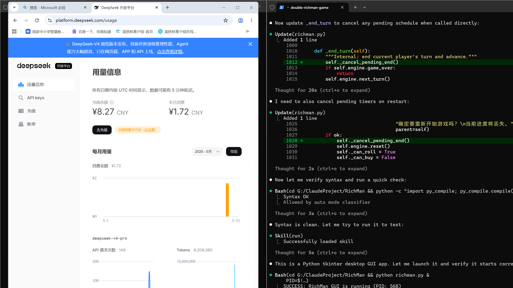

# 🎩 双人大富翁 (Two-Player Monopoly)

> 基于 Python + Pygame 的双人本地大富翁游戏，适配 Windows 高分辨率屏幕，支持多种版本。

## 📸 游戏截图



## 🎮 游戏版本

| 版本 | 文件 | 分辨率 | 特性 |
|------|------|--------|------|
| **原版** | `richman.py` | 2400×1600 | 基础双人对战、地产买卖、过路费 |
| **卡片版** | `monopoly_with_cards.py` | 2400×1600 | 原版 + 完整的机遇卡/命运卡系统 |
| **最终版** | `monopoly_final.py` | 2400×1600 | 卡片版 + 背景音乐/音效 + 地产抵押 |
| **4K旗舰版** | `monopoly_4k_ultimate.py` | 3840×2160 | 最终版 + 超高清UI + 2200×2200棋盘 + 音量调节 + 20%过路费 |

## 📦 下载

直接下载打包好的 EXE 文件（无需 Python 环境，Windows 双击即玩）：

👉 **[下载 RichMan_Releases.zip](https://github.com/programlj/RichMan/releases/latest/download/RichMan_Releases.zip)**

或从 `Releases` 页面手动下载。

## 🚀 从源码运行

### 环境要求

- Python 3.8+
- Pygame（脚本会自动安装）

### 运行

```bash
# 4K旗舰版（推荐）
python monopoly_4k_ultimate.py

# 最终版
python monopoly_final.py

# 卡片版
python monopoly_with_cards.py

# 原版
python richman.py
```

## 🛠️ 自行打包 EXE

使用 PyInstaller 打包为独立 EXE：

```bash
pip install pyinstaller
pyinstaller 双人大富翁_4K旗舰版.spec
```

`.spec` 文件已包含所有打包配置。

## 📋 游戏规则

1. **回合制**：两位玩家轮流掷骰子，在地图上移动
2. **买地**：走到无主地块可购买，走到对手地块需支付过路费
3. **建房**：集齐同色地块后可建造房屋，提高过路费
4. **机遇/命运**：走到对应格子触发随机事件（卡片版及以上）
5. **抵押**：资金不足时可抵押地产换取现金（最终版及以上）
6. **胜负**：对手破产即获胜

## 🏗️ 项目结构

```
RichMan/
├── monopoly_4k_ultimate.py   # 4K旗舰版主程序
├── monopoly_final.py          # 最终版主程序
├── monopoly_with_cards.py     # 卡片版主程序
├── richman.py                 # 原版主程序
├── *.spec                     # PyInstaller 打包配置
├── volume_settings.json       # 音量设置
├── dist/                      # 打包好的 EXE 文件
└── screenshot*.png            # 游戏截图
```

## 📝 License

MIT License
